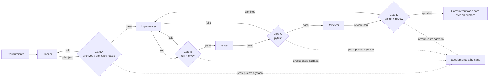

# Prompt Maestro

[](https://github.com/ancolimodio/orquestador/actions/workflows/ci.yml)


**Harness multiagente para desarrollo de software asistido por IA**, escrito en Python async.

Prompt Maestro lleva una tarea desde un requerimiento en lenguaje natural hasta un cambio de código **verificado y listo para revisión humana**. No confía en la salida del modelo: la valida con contratos tipados, guardrails deterministas y loops de verificación reales (lint, tipos, tests y análisis de seguridad).

> **Agente = Modelo + Harness.** El modelo aporta el razonamiento. El harness aporta el contexto, las herramientas, los límites y la verificación que hacen que ese razonamiento sea confiable en producción.

---

## Por qué existe

Los agentes de código escriben demos impresionantes, pero en un repositorio real fallan de formas previsibles: inventan archivos, rompen tests, tocan lo que no deben o filtran secretos. Prompt Maestro ataca cada una de esas fallas con una pieza concreta del harness:

| Falla típica de un agente | Respuesta del harness |
|---|---|
| Inventa archivos o funciones | **Gate A:** el plan se valida contra el repo real antes de escribir código |
| Devuelve JSON roto o incompleto | Contratos **Pydantic v2** estrictos, con reintento y feedback del error |
| El código no compila o no tipa | **Gate B:** `ruff` + `mypy --strict`, con la salida completa devuelta al agente |
| Rompe comportamiento existente | **Gate C:** `pytest`, con tests nuevos escritos por un agente separado |
| Introduce vulnerabilidades | **Gate D:** `bandit` + un Reviewer con checklist de seguridad |
| Toca archivos que no debe | Permisos por rol, workspace confinado y archivos protegidos |
| Filtra secretos | Detección de credenciales antes de cada escritura y entorno sin variables sensibles |
| Debilita tests para que pasen | El Tester no puede tocar tests existentes ni usar `skip`/`xfail` |
| Entra en un loop infinito | Presupuesto de 3 fallos por gate y escalamiento a un humano |

## Arquitectura



El **Orchestrator** conduce la tarea por los gates y nunca escribe código. Cada agente recibe solo el contexto de su handoff, más las reglas del repositorio (`AGENTS.md`), que se inyectan en su system prompt.

Las cinco capas del harness y dónde viven:

| Capa | Módulo |
|---|---|
| Orquestación de herramientas | `orchestrator.py`, `agents/` |
| Loops de verificación | `gates.py`, `sandbox.py` |
| Contexto y memoria | `workspace.py`, `prompts.py`, `AGENTS.md` |
| Guardrails | `guardrails.py`, `workspace.py` |
| Observabilidad | `observability.py` |

Más detalle en [`docs/architecture.md`](docs/architecture.md).

## Inicio rápido

```bash
git clone https://github.com/ancolimodio/orquestador.git
cd orquestador
python -m venv .venv && source .venv/bin/activate
pip install -e ".[dev]"
```

**Demo sin API key.** Corre el flujo completo sobre un repo temporal, con verificación real. El Implementer introduce un bug a propósito, pytest lo detecta y el harness lo corrige en la segunda vuelta:

```bash
python examples/demo.py
```

```
Eventos:
  [   start] orchestrator task  → ok (intento 1)
  [       A] planner      gate  → pass (intento 1)
  [       B] implementer  gate  → pass (intento 1)
  [       C] tester       gate  → fail (intento 1)
  [       B] implementer  gate  → pass (intento 2)
  [       C] tester       gate  → pass (intento 2)
  [       D] reviewer     gate  → pass (intento 1)
  [    done] orchestrator task  → ok (intento 1)

Estado: done
Intentos por gate: {'A': 1, 'B': 2, 'C': 2, 'D': 1}
```

**Sobre un repositorio real:**

```bash
export ANTHROPIC_API_KEY=...
prompt-maestro run "Agregá validación de email al registro de usuarios" \
  --repo ../mi-proyecto --events eventos.jsonl \
  --container-image mi-proyecto-gates:latest
```

Con `--container-image`, cada check corre en un contenedor efímero sin red y con el repo en solo lectura. La imagen debe traer `ruff`, `mypy`, `pytest`, `bandit` y las dependencias del proyecto. Sin esa opción, los tests generados corren en el host y el CLI lo avisa.

`docker/gates.Dockerfile` es una imagen de referencia con las herramientas de los gates; extendela con las dependencias de tu proyecto. También sirve para correr los tests de integración con Docker real, que son opt-in:

```bash
docker build -t prompt-maestro-gates -f docker/gates.Dockerfile .
PM_TEST_CONTAINER_IMAGE=prompt-maestro-gates pytest tests/test_container_integration.py
```

La salida es un `TaskReport` en JSON con el plan, la revisión, los archivos cambiados, los intentos por gate y, si corresponde, el motivo del escalamiento.

Los cambios se escriben directamente en el working tree, sin commits: corré el harness sobre una rama limpia, revisá el diff y abrí el PR vos. Si la tarea escala, los archivos que alcanzó a escribir quedan como están.

## Uso como librería

```python
import asyncio
from pathlib import Path

from prompt_maestro import Orchestrator
from prompt_maestro.gates import SandboxGateRunner
from prompt_maestro.llm import AnthropicLLM
from prompt_maestro.sandbox import Sandbox
from prompt_maestro.workspace import Workspace


async def main() -> None:
    repo = Path("../mi-proyecto")
    llm = AnthropicLLM(api_key="...", max_concurrency=4)
    try:
        orchestrator = Orchestrator(
            llm=llm,
            workspace=Workspace(repo),
            gate_runner=SandboxGateRunner(Sandbox(repo)),
        )
        report = await orchestrator.run("Agregá paginación al endpoint /orders")
        print(report.status, report.attempts)
    finally:
        await llm.aclose()


asyncio.run(main())
```

El modelo es intercambiable: cualquier clase que implemente el `Protocol` `LLMClient` funciona, lo que permite usar otros proveedores o `ScriptedLLM` para evals reproducibles.

## Decisiones de diseño

- **Async-first.** Todo el I/O usa `asyncio`: concurrencia estructurada con `TaskGroup`, timeouts en cada llamada externa, `Semaphore` para respetar rate limits y `to_thread` para I/O de disco. Ninguna llamada bloquea el event loop.
- **Contratos, no texto libre.** Los agentes se comunican con JSON validado por Pydantic con `extra="forbid"`. Un handoff inválido nunca avanza de fase.
- **Guardrails deterministas.** Los permisos no dependen de que el modelo "se porte bien": se verifican en código antes de cada acción.
- **Feedback completo.** Cuando un gate falla, el agente recibe la salida exacta del comando, no un resumen.
- **Los agentes nunca mergean.** El resultado final siempre pasa por un humano.

## Calidad

```bash
ruff check . && ruff format --check .
mypy
pytest --cov=prompt_maestro --cov-fail-under=80
bandit -q -r src
```

112 tests (5 de integración con contenedores, opt-in), cobertura mayor al 95%, `mypy --strict` sin errores y `bandit` limpio. El CI corre todo en cada push.

## Estructura

```
prompt-maestro/
├── AGENTS.md               # Prompt maestro: reglas para cualquier agente del repo
├── src/prompt_maestro/
│   ├── orchestrator.py     # Flujo por gates y presupuesto de reintentos
│   ├── agents/             # Planner, Implementer, Tester, Reviewer
│   ├── models.py           # Contratos de handoff (Pydantic v2)
│   ├── gates.py            # Checks por gate, ejecutados en paralelo
│   ├── sandbox.py          # Ejecución en contenedor efímero o en el host, con timeout
│   ├── guardrails.py       # Comandos prohibidos, secretos, áreas sensibles
│   ├── workspace.py        # Acceso confinado al repositorio
│   ├── llm.py              # Protocol LLMClient + cliente async de Anthropic
│   ├── prompts.py          # System prompts por rol
│   ├── observability.py    # Eventos JSONL y métricas
│   └── cli.py
├── tests/                  # 112 tests sin red; los de contenedores son opt-in
├── examples/demo.py        # Demo end-to-end sin API key
└── docs/                   # Arquitectura y convenciones
```

## Roadmap

- Métricas de tokens y costo por fase.
- Planner con análisis de símbolos vía AST en lugar de búsqueda textual.
- Suite de evals sobre tareas reales para comparar harnesses y modelos.
- Integración con GitLab y GitHub para abrir el PR automáticamente.

## Licencia

MIT © Alan Colimodio
